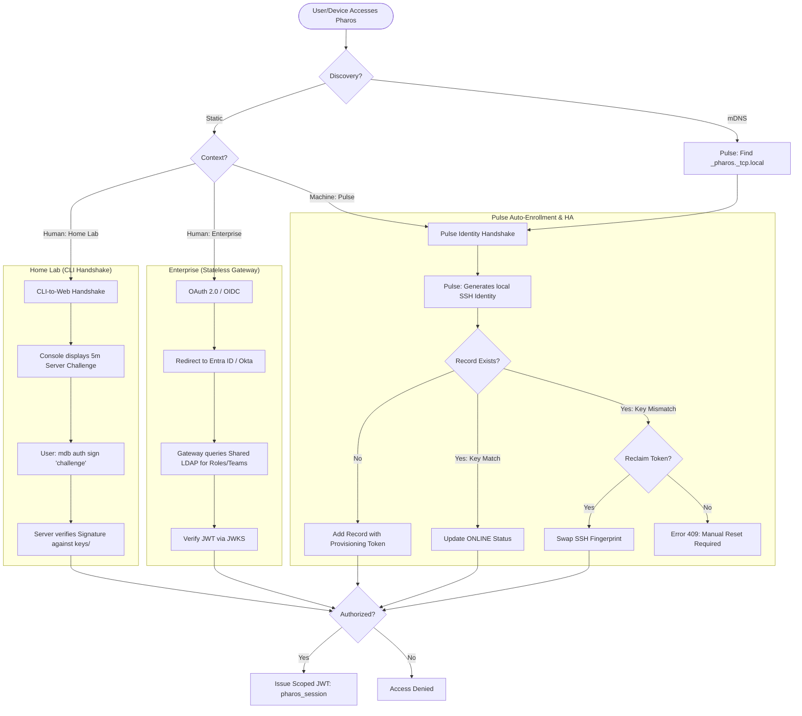

/* ========================================================================
 * Project: pharos
 * Component: Documentation / Architecture
 * File: pharos-auth-decision-tree.md
 * Author: Richard D. (https://github.com/iamrichardd)
 * License: AGPL-3.0 (See LICENSE file for details)
 * * Purpose (The "Why"):
 * Illustrates the authentication and multi-tenant authorization flow for 
 * both Home Lab and Enterprise environments. Defines the "Identity Bonding,"
 * "Team Ownership," and "High Availability (HA)" logic required for resilient 
 * Pulse auto-enrollment.
 * * Traceability:
 * Related to Task 16.4 (Issue #66) and Phase 14 (Multi-Tenancy).
 * ======================================================================== */

# Pharos Authentication, Identity & HA Decision Tree

## 1. Authentication Postures

Pharos adapts to the deployment environment to provide either frictionless "Zero-Host" handshakes or hardened Enterprise SSO with High Availability support.

### 1.1 Decision Tree (Mermaid)

## 2. Authorization & Scoping Logic

Pharos uses a **Team-Based Ownership** model to ensure security across multiple teams and thousands of machines.

### 2.1 Multi-Tenant Roles
| Role | Permissions | Membership Source |
| :--- | :--- | :--- |
| **Admin** | Full read/write on ALL records. | `authorized_keys/admin.pub` OR LDAP Group |
| **Member** | Write access to records matching `OwnerTeam`. | `roles.yaml` OR LDAP Group Membership |
| **Machine** | Write access ONLY to its own record (Fingerprint Match). | `pulse_id` (SSH Key) |
| **Guest** | Read-only access to public fields. | Default (No Auth) |

### 2.2 Identity "Bonding" & Ownership
1.  **First-to-Claim**: When a machine (Pulse) or human creates a record, they define an `owner_team` (via config/env).
2.  **Fingerprint Lock**: The record is "bonded" to the creator's SSH public key fingerprint.
3.  **Team Scoping**: Any human user belonging to that `owner_team` (verified via LDAP `memberOf` or `roles.yaml`) can modify the record.
4.  **Collision (RMA/Rollback)**: If a new machine tries to claim an existing Hostname/IP with a different key, it is rejected unless a **Reclaim Token** is provided by an Admin.

## 3. High Availability (HA) & Recovery

Pharos is designed for resilience across power cycles and network partitions.

### 3.1 Stateless Gateways (Enterprise)
- **Shared Source of Truth**: Multiple `pharos-server` instances run as "Gateways," querying a centralized LDAP or distributed database.
- **Load Balancing**: Clients connect via a Load Balancer VIP or DNS Round-Robin.
- **Identity Consistency**: Because fingerprints are stored in the shared backend, a Pulse agent can authenticate against *any* gateway node seamlessly.

### 3.2 mDNS Discovery (Pulse)
- **Dynamic Peer Finding**: Pulse agents use mDNS to discover all services of type `_pharos._tcp.local` on the subnet.
- **Multi-Registration**: The agent attempts to register its state with **all** discovered servers. This ensures state synchronization in decentralized (Home Lab) environments without a shared backend.
- **Resilience**: If the primary server reboots, the agent automatically retries the discovery/registration loop.

### 3.3 Persistence & Recovery
- **Home Lab**: Uses a single-primary model with optional shared network volumes (`/var/lib/pharos`) for state survival.
- **Conflict Resolution**: The backend (LDAP/SQL) enforces uniqueness of hostnames and fingerprints to prevent "Split-Brain" identity claims.

## 4. Implementation & Deployment

### 4.1 The Sandbox "Simulator"
To provide an immediate, functional experience for engineers, the Pharos Sandbox operates in **Simulator Mode**.
- **Unified Stack**: `pharos-server` and `pharos-pulse` are bundled in a single environment.
- **Bootstrapped Identity**: Upon startup, the local Pulse agent automatically registers the server itself (e.g., `pharos-main`) in the `mdb`.
- **Visibility**: When a user first accesses the Web Console, they immediately see one **ONLINE** record, verifying the Pulse heartbeat and identity bonding logic.

### 4.2 Systemd Integration
- **Host Deployment**: On Linux hosts, `pharos-pulse.service` depends on `pharos-server.service` using `After=` and `Requires=`.
- **Wait-for-Server Logic**: The Pulse agent initiates an internal retry loop, waiting for the server's TCP listener (Port 2378) to be healthy before initiating registration.

## 5. Identified Code Paths & Resolutions

### 5.1 Challenge Management (High Priority)
- **Current**: Client-originated challenges (Vulnerable to replay).
- **Resolution**: Move challenge generation to `Command::Login` and store statefully in `pharos-server` with a **5-minute TTL**.

### 5.2 Pulse Identity Reclaim
- **Current**: No collision handling.
- **Resolution**: Implement `Error 409` in `handle_connection` for key mismatches on existing hostnames.

### 5.3 LDAP Admin Query
- **Current**: Placeholder in `main.rs`.
- **Resolution**: Implement `LdapAuth` backend that performs group-to-role translation.
