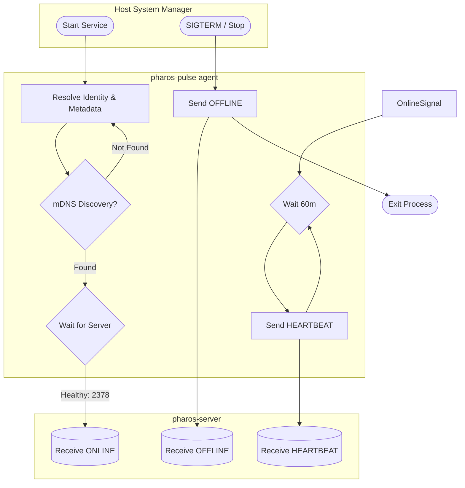
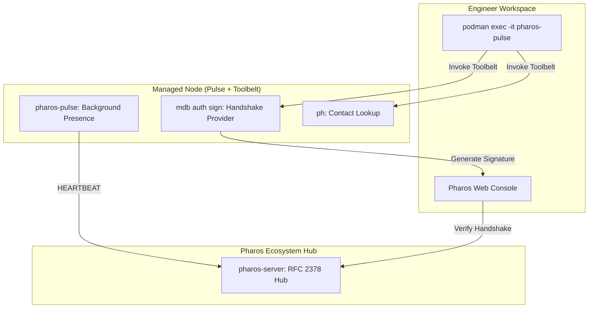

<!--
/* ========================================================================
 * Project: pharos
 * Component: Documentation / Architecture
 * File: pharos-pulse-spec.md
 * Author: Richard D. (https://github.com/iamrichardd)
 * License: AGPL-3.0 (See LICENSE file for details)
 * * Purpose (The "Why"):
 * Defines the technical specification for the pharos-pulse presence agent.
 * Its primary role is identity assertion and lifecycle tracking (Online/Offline)
 * for nodes across Linux, macOS, and Windows platforms.
 * * Traceability:
 * Related to "Pulse Agent" Architecture definition. Replaces metric-heavy 
 * heartbeat with presence-focused telemetry.
 * ======================================================================== */
-->

# Pharos Pulse (`pharos-pulse`) & Toolbelt Technical Specification

## 1. Overview
The `pharos-pulse` agent is a lightweight, statically linked Rust binary. While its primary background role is to ensure a node's presence and identity are known to the Pharos server, it also serves as the **Pharos Toolbelt**. 

In the "Toolbelt" configuration (standard for Sandbox and managed nodes), the container image bundles the `ph` and `mdb` CLI utilities. This transforms the Pulse agent from a passive reporter into an active management endpoint, allowing engineers to perform queries, updates, and "CLI Handshakes" directly from the managed node without local host installations.

**Note:** High-frequency performance metrics (Prometheus/OpenTelemetry) are handled centrally by the `pharos-server` or dedicated collectors; `pharos-pulse` focuses strictly on identity, availability, and providing a local management interface.

## 2. Core Constraints
- **Language**: Rust
- **Linking**: Fully static (musl for Linux).
- **Execution Context**: Runs as a background service/daemon (Systemd, launchd, SCM).
- **Resource Footprint**: Must consume less than 12MB RAM (including CLI overhead) and negligible CPU.
- **Included Utilities**: `ph` (People/Contact Management), `mdb` (Machine/Infrastructure Management).

## 3. Platform Integrations (Presence Lifecycle)
The agent integrates with the host's system manager to capture power events and maintain a persistent presence.



### 3.1 mDNS Discovery & HA
In High Availability (HA) or dynamic home lab environments, `pharos-pulse` performs an mDNS search for services of type `_pharos._tcp.local`. 
- **Multi-Registration**: The agent attempts to register its state with **all** discovered servers to ensure state consistency across stateless gateways.
- **Fallback**: If no servers are discovered via mDNS, the agent falls back to the static `PHAROS_SERVER` environment variable.

### 3.2 Wait-for-Server Logic (Healthcheck)
The agent MUST NOT attempt registration until it verifies the target server's TCP listener is accepting connections.
- **Mechanism**: A retry loop with exponential backoff (e.g., 1s, 2s, 4s... up to 60s) probing Port 2378.
- **Deployment**: In `systemd` environments, the agent uses `After=pharos-server.service` but still employs the internal wait-loop to ensure the application-layer is ready.

### 3.3 Online Signal (Startup)
On service start, `pharos-pulse` immediately performs:
1.  **Identity Resolution**: Loads/Generates the local SSH identity key.
2.  **Metadata Collection**: Gathers hardware UUID, OS version, and network interfaces.
3.  **Presence Assertion**: Sends an `ONLINE` event to the Pharos server.

### 3.4 Periodic Heartbeat (Hourly)
To ensure the server's record remains "Fresh" and to detect ungraceful failures (e.g., power loss without shutdown), the agent sends a low-impact `HEARTBEAT` event every **60 minutes**.

### 3.5 Offline Signal (Shutdown)
The agent must catch `SIGTERM` (Linux/macOS) or the `Service Stop` control code (Windows) to send a final `OFFLINE` message before the process exits.

## 4. Ecosystem Management (The Toolbelt)
The Pulse agent container functions as a **Managed Node** with a full management toolset. This enables a "Zero-Host" workflow where an engineer can authenticate a Web Console session from a remote terminal.



## 5. Presence Payload Schema
Sent via JSON over a secure channel to the Pharos server.

```json
{
  "event": "ONLINE | HEARTBEAT | OFFLINE",
  "identity": {
    "hw_uuid": "string",
    "hostname": "string",
    "ssh_pubkey_fingerprint": "string"
  },
  "metadata": {
    "os_family": "string",
    "os_version": "string",
    "kernel_version": "string",
    "platform": "string (e.g., proxmox-lxc, bare-metal)",
    "local_ips": ["string"]
  },
  "timestamp": "string (ISO8601)"
}
```

## 5. Security & Enrollment
- **Local Key Pair**: Uses `/etc/pharos/pulse_id` (Linux/macOS) or Protected Storage (Windows).
- **Authentication**: Payloads are signed using the agent's private key.
- **Provisioning**: Can be pre-provisioned via `mdb` or auto-enrolled using a short-lived token generated by the Pharos Web Console.
