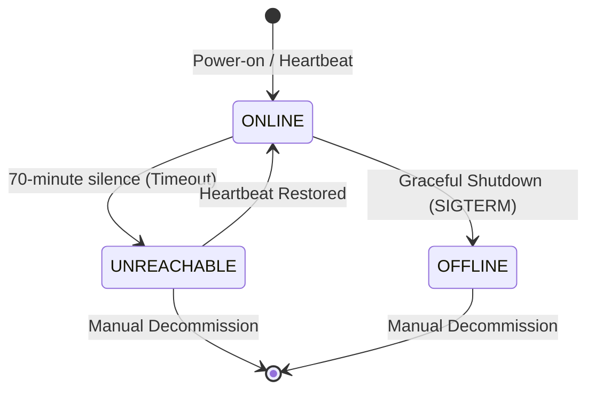

<!--
/* ========================================================================
 * Project: pharos
 * Component: Documentation / Standards
 * File: pharos-rfc-extension-proposal.md
 * Author: Richard D. (https://github.com/iamrichardd)
 * License: AGPL-3.0 (See LICENSE file for details)
 * * Purpose (The "Why"):
 * Proposes the "Pharos Protocol Extensions (PhP)" to modernize RFC 2378 (Ph)
 * with support for Choice-Based Selection, Presence Fencing, and Security 
 * Tiers. This provides a formal spec for future AI and Human implementers.
 * * Traceability:
 * Formally extends RFC 2378 (CCSO Ph).
 * ======================================================================== */
-->

# Pharos Protocol Extensions (PhP) - Draft Proposal

## 1. Introduction
RFC 2378 (1998) defines a simple, read-optimized phonebook protocol (Ph). However, it lacks support for modern infrastructure management workflows, presence monitoring, and multi-tenant security. This document proposes backward-compatible extensions to the Ph protocol.

## 2. Grammatical Extensions

### 2.1 Field Alternation (Selection & Return)
PhP introduces the **Alternation Operator `[f1|f2|f3]`** for both selection and return clauses.
- **Selection**: `[sn|serial_number]=1234` expands to a logical `OR` search.
- **Return**: `return [sn|serial_number]` implements a **Coalesce** operation, returning the first non-null field found.

### 2.2 Security Tiers
PhP formalizes the **Triple-Tier Security Model**:
- **`open`**: Read-only, unauthenticated access to public fields.
- **`protected`**: Authenticated (SSH/LDAP) access to internal fields.
- **`scoped`**: Multi-tenant isolation; users only see records within their LDAP/Team scope.

## 3. Presence & Lifecycle Tracking

### 3.1 The `presence` Attribute
PhP mandates a `presence` field for `Machine` (type=machine) records with the following state machine:
- **`ONLINE`**: Explicitly reported heartbeat or power-on.
- **`OFFLINE`**: Explicitly reported graceful shutdown (SIGTERM).
- **`UNREACHABLE`**: Inferred state after a 70-minute silence (Dead Man's Switch).

### 3.2 Fencing Protocol
Implementers of PhP MUST NOT perform destructive automation (e.g., node replacement) on records in the `UNREACHABLE` state. Only `OFFLINE` or a human-led `status` change (e.g., `RMA`, `DECOMMISSIONED`) authorizes decommissioning.

## 4. Authentication & Auth Hooks
PhP formalizes **SSH-Key Based Authorization** for write operations, utilizing the `id` command and a new `auth` command extension to negotiate signatures before allowing `add`, `change`, or `delete` operations.

## 5. Publishing Plan
- **Pharos-V1 Spec**: This document serves as the internal specification.
- **Internet-Draft**: We will format this proposal using **xml2rfc** syntax for submission as an Informational IETF Draft.
- **Open Source Advocate Persona**: We will publish a "Why Ph Still Matters" whitepaper on the marketing site to drive community adoption of these extensions.

## 6. CLI Human-Readable Formatting (MDB Extension)
While RFC 2378 defines the protocol's raw wire format, PhP extends the client behavior for `mdb` (Machine Database) to support human-centric terminal UX.

### 6.1 Transformation Flag
Implementations of `mdb` SHOULD support a `--human` (or `-H`) flag to transform machine-readable values into human-friendly formats.

### 6.2 Unit Transformations
- **Memory/Storage**: Fields with suffixes such as `_kb`, `_bytes`, or `_mb` SHOULD be scaled to the most appropriate unit (KB, MB, GB, TB) with one decimal place.
- **Temporal context**: ISO8601 UTC strings (e.g., `2026-03-15T14:30:00Z`) SHOULD be formatted into a cleaner, localized string (e.g., `2026-03-15 14:30:00`) when the human flag is active.

### 6.3 Interoperability Mandate
Raw protocol data MUST be the default output of the CLI to ensure backward compatibility with existing Unix pipelines and scripts (e.g., `grep`, `awk`, `jq`).

