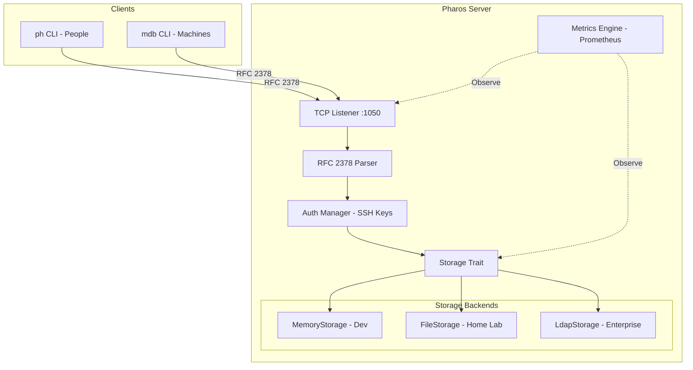

# Pharos Architecture

Project Pharos is a highly performant, read-optimized client-server ecosystem based on RFC 2378 (Phonebook Protocol).

## System Overview

## Core Components

### 1. Pharos Server (`pharos-server`)
The backend engine handling connection lifecycle, protocol parsing, and storage abstraction.
- **Protocol:** RFC 2378 (Ph) with `auth` extension.
- **Authentication:** SSH-key based challenge-response for Write operations.
- **Metrics:** Integrated Prometheus scrape point (`:9090/metrics`) and health monitoring.

### 2. CLI Clients
- **`ph`:** Optimized for human contact management.
- **`mdb`:** Optimized for machine/infrastructure asset management.
- Both support automatic authentication via local SSH private keys.

### 3. Storage Tiering
- **Development:** Zero-configuration in-memory storage.
- **Home Lab:** File-level, restart-survivable JSON storage (optimized for LXC).
- **Enterprise:** LDAP-backed storage utilizing standard schemas (`inetOrgPerson`, `ipHost`).
