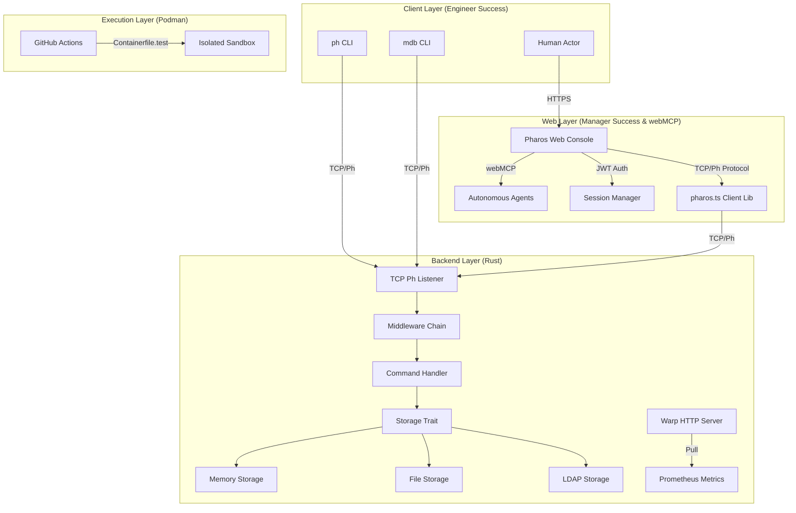
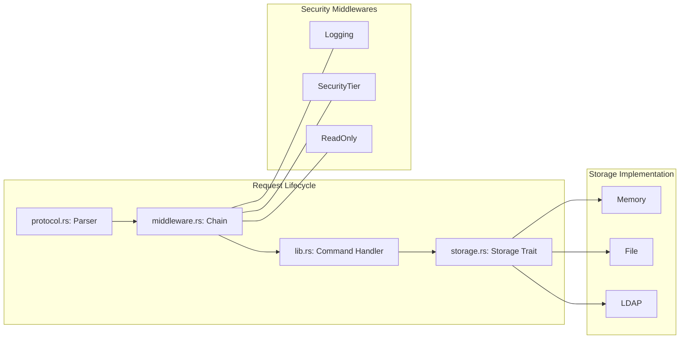
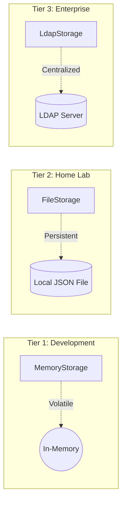
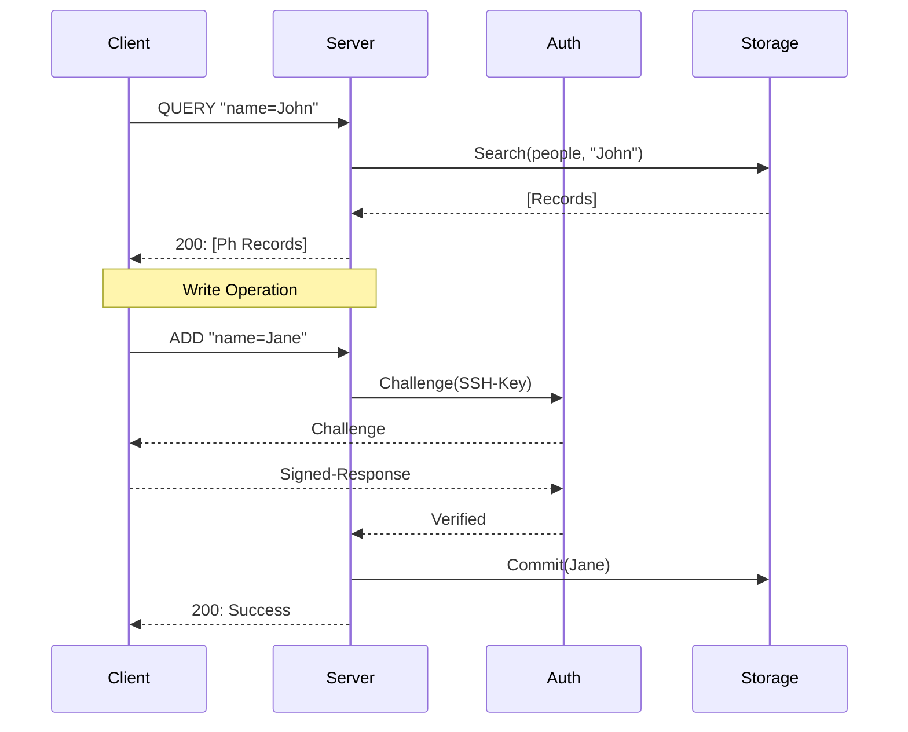

# Pharos Architecture

Pharos is a high-rigor, read-optimized client-server ecosystem based on RFC 2378 (Phonebook Protocol). It serves as a **Unified Source of Truth**, eliminating the "Hallucination Gap" in infrastructure discovery by providing **Deterministic Infrastructure** for both humans and autonomous AI Agents.

For more information on the architectural philosophy and the Collaborative Force Multiplier role, visit [iamrichardd.com](https://iamrichardd.com).

## Platform Architecture (Macro-View)
Visualizing the high-rigor interaction across the "Trust Boundary," highlighting the **webMCP Grounding Layer** as the primary engine for agentic autonomy.

```mermaid
graph TD
    subgraph "Client Layer (Engineer Success)"
        Human[Human Actor]
        CLI_PH[ph CLI]
        CLI_MDB[mdb CLI]
    end

    subgraph "Web Layer (Manager Success & webMCP)"
        Human -->|HTTPS| WebConsole[Pharos Web Console]
        WebConsole -->|webMCP| AI_Agents[Autonomous Agents]
        WebConsole -->|JWT Auth| SessionManager[Session Manager]
        WebConsole -->|TCP/Ph Protocol| ClientLib[pharos.ts Client Lib]
    end

    subgraph "Backend Layer (Rust)"
        CLI_PH -->|TCP/Ph| ProtoListener[TCP Ph Listener]
        CLI_MDB -->|TCP/Ph| ProtoListener
        ClientLib -->|TCP/Ph| ProtoListener
        
        ProtoListener --> Middleware[Middleware Chain]
        Middleware --> CommandHandler[Command Handler]
        CommandHandler --> StorageTrait[Storage Trait]
        
        StorageTrait --> MemStore[Memory Storage]
        StorageTrait --> FileStore[File Storage]
        StorageTrait --> LDAPStore[LDAP Storage]
        
        Warp[Warp HTTP Server] -->|Pull| Metrics[Prometheus Metrics]
    end

    subgraph "Execution Layer (Podman)"
        CI[GitHub Actions] -->|Containerfile.test| Sandbox[Isolated Sandbox]
    end
```

## Application Architecture (Micro-View)
Detailing the internal async flow and the Vertical Slice Architecture (VSA) that keeps features decoupled and maintainable.

```mermaid
graph LR
    subgraph "Request Lifecycle"
        Parse[protocol.rs: Parser] --> Mid[middleware.rs: Chain]
        Mid --> Logic[lib.rs: Command Handler]
        Logic --> Store[storage.rs: Storage Trait]
    end

    subgraph "Storage Implementation"
        Store --> Mem[Memory]
        Store --> File[File]
        Store --> LDAP[LDAP]
    end

    subgraph "Security Middlewares"
        Mid --- Log[Logging]
        Mid --- Auth[SecurityTier]
        Mid --- RO[ReadOnly]
    end
```

## Storage Tiering Logic
Pharos adapts to your environment, ensuring that your data is exactly as persistent as you need it to be.

```mermaid
graph LR
    subgraph "Tier 1: Development"
        Mem[MemoryStorage]
        Mem -.->|Volatile| Data((In-Memory))
    end

    subgraph "Tier 2: Home Lab"
        File[FileStorage]
        File -.->|Persistent| JSON[(Local JSON File)]
    end

    subgraph "Tier 3: Enterprise"
        LDAP[LdapStorage]
        LDAP -.->|Centralized| Directory[(LDAP Server)]
    end
```

## Core Protocol: RFC 2378 (Modified)

Pharos implements the Phonebook Protocol with extensions for modern infrastructure management.

### Message Flow
1. **QUERY:** Client sends a search string.
2. **DISCRIMINATE:** Server identifies if the target is a `person` or `machine`.
3. **AUTH (if Write):** Server issues an SSH challenge. Client signs and returns.
4. **RESPONSE:** Server returns records in Ph format.

```mermaid
sequenceDiagram
    participant Client
    participant Server
    participant Auth
    participant Storage

    Client->>Server: QUERY "name=John"
    Server->>Storage: Search(people, "John")
    Storage-->>Server: [Records]
    Server-->>Client: 200: [Ph Records]

    Note over Client,Server: Write Operation
    Client->>Server: ADD "name=Jane"
    Server->>Auth: Challenge(SSH-Key)
    Auth-->>Client: Challenge
    Client-->>Auth: Signed-Response
    Auth-->>Server: Verified
    Server->>Storage: Commit(Jane)
    Server-->>Client: 200: Success
```

## Core Components

### 1. Pharos Server (`pharos-server`)
The high-performance engine handling connection lifecycle, protocol parsing, and storage abstraction.
- **Protocol:** RFC 2378 (Ph) with `auth` extension.
- **Deterministic Truth:** Optimized for high-rigor physical attribution of network assets.
- **Authentication:** SSH-key based challenge-response for Write operations.
- **Metrics:** Integrated Prometheus scrape point (`:9090/metrics`) and health monitoring.

### 2. CLI Clients (Engineer Success)
- **`ph`:** Optimized for human contact management with millisecond search.
- **`mdb`:** Optimized for machine/infrastructure asset management, providing the "Physical Truth" of the network.
- Both support automatic authentication via local SSH private keys to reduce engineering toil.

### 3. Pharos Web Console (Manager Success)
The Pharos Web Console serves as the **Truth Engine** for the modern enterprise.
- **Agentic Autonomy:** Provides a deterministic grounding layer for AI Agents via the **webMCP** protocol.
- **Visibility:** Centralized orchestration and resource management for complex environments.

### 4. Home Lab Password Store (`src/features/auth/password-store.ts`)
A secure, file-based persistence layer for the Web Console's admin password.
- **Security:** Uses `scrypt` hashing with unique salts for every password update.
- **Persistence:** Stores hashes in `data/auth_store.json` to ensure credentials survive container restarts.
- **Policy:** Enforces mandatory password rotation upon the first login with default credentials.

### 4. Storage Tiering
- **Development:** Zero-configuration in-memory storage.
- **Home Lab:** File-level, restart-survivable JSON storage (optimized for LXC).
- **Enterprise:** LDAP-backed storage utilizing standard schemas (`inetOrgPerson`, `ipHost`).
