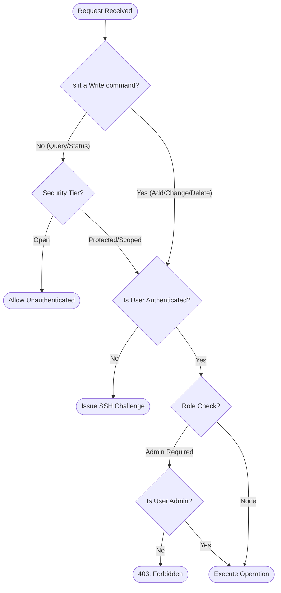

/* ========================================================================
 * Project: pharos
 * Component: Documentation
 * File: docs/DECISIONS.md
 * Author: Richard D. (https://github.com/iamrichardd)
 * License: AGPL-3.0 (See LICENSE file for details)
 * * Purpose (The "Why"):
 * This file codifies the "Why" behind the architectural and user-facing
 * decision paths. It serves as a bridge for both human operators and
 * AI Agents to understand the system's intent and boundaries.
 * * Traceability:
 * Related to Phase 17 Gap Analysis.
 * ======================================================================== */

# Pharos Decision Matrix

This guide helps you navigate the Pharos ecosystem by mapping your intent to the most effective tool and configuration.

## 1. Choosing Your Interface
We provide multiple ways to interact with Pharos. Choose the one that best fits your current context.

| If your goal is... | Use this tool... | Because... |
| :--- | :--- | :--- |
| **Rapid searching** | `ph` or `mdb` CLI | It's local, pipeable, and requires zero context switching. |
| **Bulk automation** | `pharos-client` lib | It provides programmatic access with built-in SSH-signing. |
| **Visual oversight** | **Web Console** | It maps infrastructure relationships (IP/Hostname) visually. |
| **AI Management** | **MCP Server** | It provides a secure "Human-in-the-Loop" bridge for agents. |

## 2. Selecting a Storage Tier
Pharos is designed to grow with your environment, from a single laptop to a global enterprise.

- **IF** You are developing or testing **THEN** use **MemoryStorage** (`PHAROS_STORAGE_PATH` is unset).
    - *Success Factor:* Zero-configuration, sub-millisecond latency.
- **IF** You are a Home Labber (Single-Node) **THEN** use **FileStorage** (`PHAROS_STORAGE_PATH=/path/to/pharos.json`).
    - *Success Factor:* Simple backups, restart-survivable, no database to manage.
- **IF** You are an Enterprise Engineer **THEN** use **LdapStorage** (`PHAROS_LDAP_URL=...`).
    - *Success Factor:* Centralized identity, scales with your existing directory service.

## 3. Navigating the Security Boundary
Pharos balances "Read-Optimized" openness with "Write-Authenticated" integrity.

## 4. Mandatory Password Rotation (Home Lab)
To balance "Frictionless Setup" with "Day 1 Security," Pharos enforces a mandatory password update policy for the Web Console.

- **IF** The user logs in with the default password (`admin:admin`) **THEN** The session is flagged with `mustChangePassword: true`.
- **IF** The session is flagged **THEN** Middleware intercepts all requests and redirects the user to `/change-password`.
- **IF** The user submits a new password **THEN** The hash is saved to `data/auth_store.json` and the flag is cleared.

## 5. Machine Presence Metadata (Temporal Context)
To enable the **Tri-State Presence Model** (ONLINE, OFFLINE, UNREACHABLE), Pharos automatically injects temporal metadata into every machine record.

- **`created_at`**: Captured during the initial registration (first `ONLINE` signal).
- **`last_seen_at`**: Updated on every interaction (HEARTBEAT, ONLINE, manual `add`).
- **Standardization**: All timestamps are stored as **ISO8601 UTC strings**.
- **Naming**: We use `_at` suffix (e.g., `created_at`) rather than `_datetime` to align with modern REST and Graph APIs.

## 7. Human-Readable CLI Output (MDB)
To balance "Script-First" interoperability with "Human-First" readability, the `mdb` CLI implements a transform layer for display.

- **IF** The `--human` (or `-H`) flag is used **THEN** Raw values are transformed into human-friendly formats.
- **IF** The flag is omitted **THEN** Values are displayed in their raw, machine-readable protocol format (e.g., ISO8601, KB).
- **Success Factor:** Use `clap` for standardized argument parsing and `chrono` for precise temporal transformations.

## 6. Troubleshooting Connectivity
If a connection fails, follow this decision path:

1.  **Check the Port:** The Pharos protocol defaults to **2378** (TCP).
2.  **Verify the Tier:** Is the server in `Protected` mode? (Check `PHAROS_SECURITY_TIER`).
3.  **Validate Keys:** Does the `PHAROS_KEYS_DIR` contain your `.pub` key?
