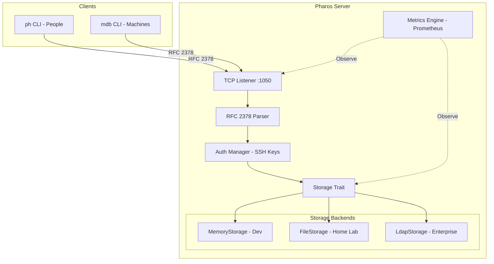
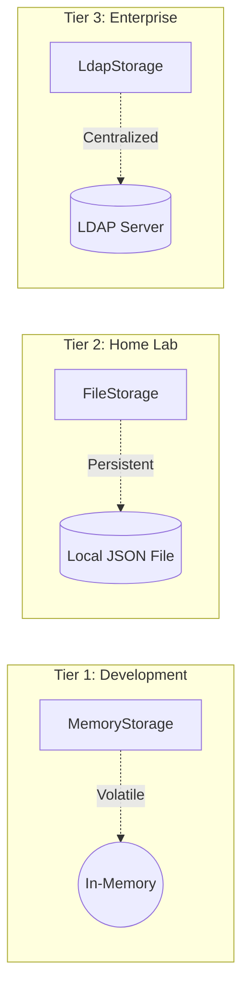
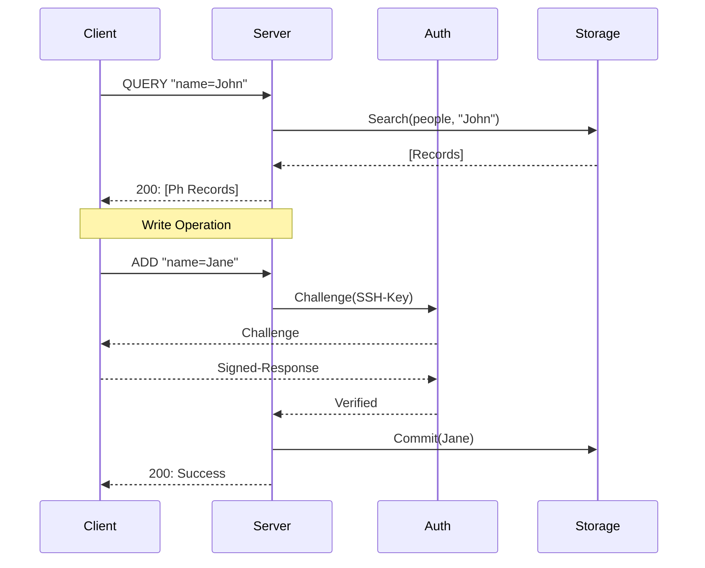

/* ========================================================================
 * Project: pharos
 * Component: Marketing Site
 * File: architecture.mdx
 * Author: Richard D. (https://github.com/iamrichardd)
 * License: AGPL-3.0 (See LICENSE file for details)
 * * Purpose (The "Why"):
 * Detailed architectural overview of the Pharos ecosystem.
 * * Traceability:
 * Related to GitHub Issue #28, implements the documentation port to MDX.
 * ======================================================================== */

Project Pharos is a highly performant, read-optimized client-server ecosystem based on RFC 2378 (Phonebook Protocol).

## System Overview

The following diagram illustrates the high-level architecture of Pharos, showing the interaction between CLI clients and the server components.

## Storage Tiering Logic

Pharos uses a tiered storage approach to cater to different deployment environments, from volatile development instances to persistent enterprise-grade directory services.

## Core Protocol: RFC 2378 (Modified)

Pharos implements the Phonebook Protocol with extensions for modern infrastructure management and secure authentication.

### Message Flow
1. **QUERY:** Client sends a search string.
2. **DISCRIMINATE:** Server identifies if the target is a `person` or `machine`.
3. **AUTH (if Write):** Server issues an SSH challenge. Client signs and returns.
4. **RESPONSE:** Server returns records in Ph format.

## Core Components

### 1. Pharos Server (`pharos-server`)
The backend engine handling connection lifecycle, protocol parsing, and storage abstraction.
- **Protocol:** RFC 2378 (Ph) with `auth` extension.
- **Authentication:** SSH-key based challenge-response for Write operations.
- **Metrics:** Integrated Prometheus scrape point (`:9090/metrics`) and health monitoring.

### 2. CLI Clients
- **`ph`:** Optimized for human contact management.
- **`mdb`:** Optimized for machine/infrastructure asset management.
- Both support automatic authentication via local SSH private keys.

### 3. Storage Tiering
- **Development:** Zero-configuration in-memory storage.
- **Home Lab:** File-level, restart-survivable JSON storage (optimized for LXC).
- **Enterprise:** LDAP-backed storage utilizing standard schemas (`inetOrgPerson`, `ipHost`).
