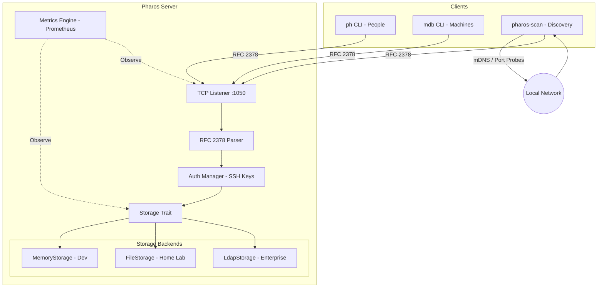
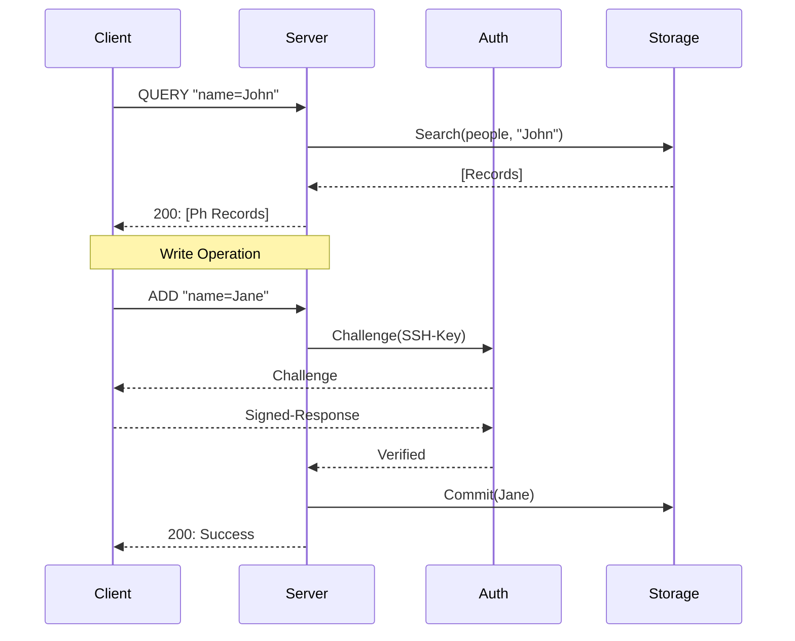
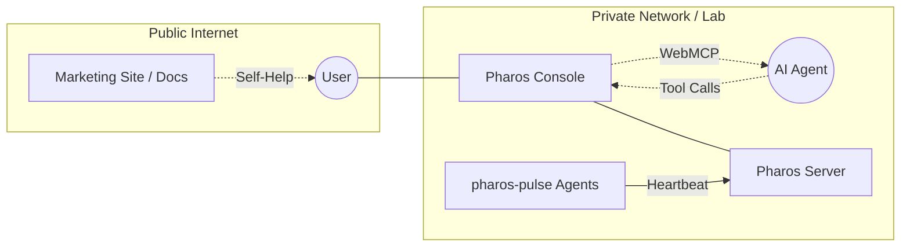

import TieredTabs from '../../components/TieredTabs.astro';

/* ========================================================================
 * Project: pharos
 * Component: Marketing Site
 * File: architecture.mdx
 * Author: Richard D. (https://github.com/iamrichardd)
 * License: AGPL-3.0 (See LICENSE file for details)
 * * Purpose (The "Why"):
 * Detailed architectural overview of the Pharos ecosystem.
 * * Traceability:
 * Related to GitHub Issue #28, implements the documentation port to MDX.
 * Related to GitHub Issue #55, implements tiered tab UX.
 * ======================================================================== */

Project Pharos is a highly performant, read-optimized client-server ecosystem based on RFC 2378 (Phonebook Protocol).

## System Overview

The following diagram illustrates the high-level architecture of Pharos, showing the interaction between CLI clients and the server components.



## Storage Tiering Logic

<TieredTabs>
  <div slot="homelab">
    ### 🏠 Home Lab: Persistent File Storage
    Pharos uses a file-level, restart-survivable JSON storage engine optimized for LXC containers. This ensures high performance with minimal configuration.

    ```mermaid
    graph LR
        File[FileStorage]
        File -.->|Persistent| JSON[(Local JSON File)]
    ```
  </div>

  <div slot="enterprise">
    ### 🏢 Enterprise: Centralized LDAP Storage
    For Enterprise environments, Pharos acts as a high-speed cache and query layer for your central LDAP directory, supporting standard schemas and high-concurrency reads.

    ```mermaid
    graph LR
        LDAP[LdapStorage]
        LDAP -.->|Centralized| Directory[(LDAP Server)]
    ```
  </div>
</TieredTabs>

## Core Protocol: RFC 2378 (Modified)

Pharos implements the Phonebook Protocol with extensions for modern infrastructure management and secure authentication.

### Message Flow
1. **QUERY:** Client sends a search string.
2. **DISCRIMINATE:** Server identifies if the target is a `person` or `machine`.
3. **AUTH (if Write):** Server issues an SSH challenge. Client signs and returns.
4. **RESPONSE:** Server returns records in Ph format.



## Core Components

### 1. Pharos Server (`pharos-server`)
The backend engine handling connection lifecycle, protocol parsing, and storage abstraction.
- **Protocol:** RFC 2378 (Ph) with `auth` extension.
- **Authentication:** SSH-key based challenge-response for Write operations.
- **Metrics:** Integrated Prometheus scrape point (`:9090/metrics`) and health monitoring.

### 2. CLI Clients
- **`ph`:** Optimized for human contact management.
- **`mdb`:** Optimized for machine/infrastructure asset management.
- **`pharos-scan`:** Automated discovery engine using mDNS and port probes to identify and provision assets into Pharos.
- All clients support automatic authentication via local SSH private keys and share a common async core.

### 3. Storage Tiering
- **Development:** Zero-configuration in-memory storage.
- **Home Lab:** File-level, restart-survivable JSON storage (optimized for LXC).
- **Enterprise:** LDAP-backed storage utilizing standard schemas (`inetOrgPerson`, `ipHost`).

## Multi-Tenant & Triple-Tier Security

Pharos implements a flexible security model designed to scale from a single user's "YOLO Lab" to a multi-tenant Enterprise environment.

<TieredTabs>
  <div slot="homelab">
    ### 🏠 Home Lab: The "YOLO" Security Model
    In Home Lab environments, Pharos prioritizes speed and accessibility.

    - **Open Access**: Read operations are anonymous and unauthenticated.
    - **SSH Challenge**: Write operations still require a valid signature from an authorized SSH key for basic safety.
    - **Use Case**: Single-user labs or trusted home networks.
  </div>

  <div slot="enterprise">
    ### 🏢 Enterprise: Protected & Scoped Models
    For larger environments, Pharos adds layers of isolation and authentication.

    - **Protected Tier**: Read access is restricted via tokens or IP whitelists.
    - **Scoped Tier**: Fully multi-tenant. Every record belongs to a `team_scope`.
    - **Filtering**: Queries are automatically filtered to only show records the user's authenticated identity is allowed to see.
    - **Provenance**: Records contain metadata tracking `created_by` identity and the `provisioned_at` timestamp.
  </div>
</TieredTabs>

## The Dual-Site Ecosystem

Pharos distinguishes between documentation (static) and management (dynamic) to ensure high availability and security.



### 1. Marketing & Documentation (`iamrichardd.com/pharos/`)
- **Type**: Static Site (Astro/MDX).
- **Purpose**: Architecture guides, "How-To" tutorials, and open-source advocacy.
- **Why**: Ensures that even if your Pharos server is down, you still have access to the documentation on how to fix it.

### 2. Pharos Console (`pharos-console`)
- **Type**: Dynamic Web Application & MCP Server.
- **Purpose**: Real-time TUI/Web dashboard, SSH key management, and AI Agent orchestration.
- **Features**:
    - **WebMCP Bridge**: Allows your browser to act as a secure proxy for AI Agents.
    - **Pulse Monitor**: Real-time heartbeat visualization for all `pharos-pulse` agents.
    - **Enrollment**: One-click provisioning for new nodes.
