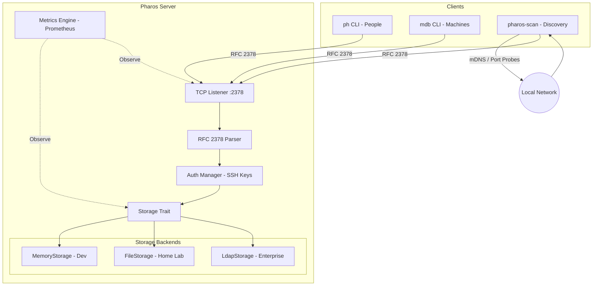
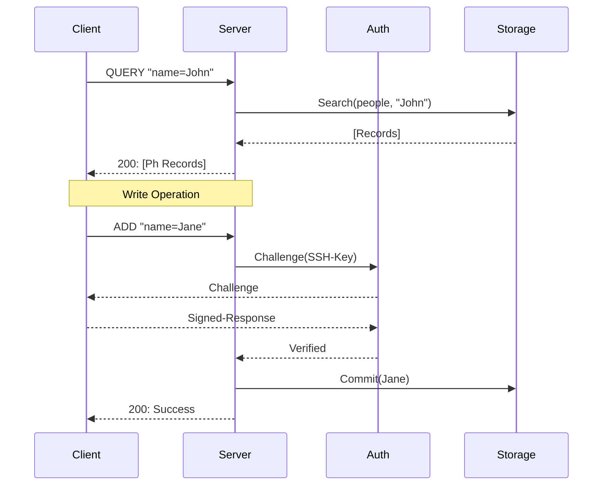
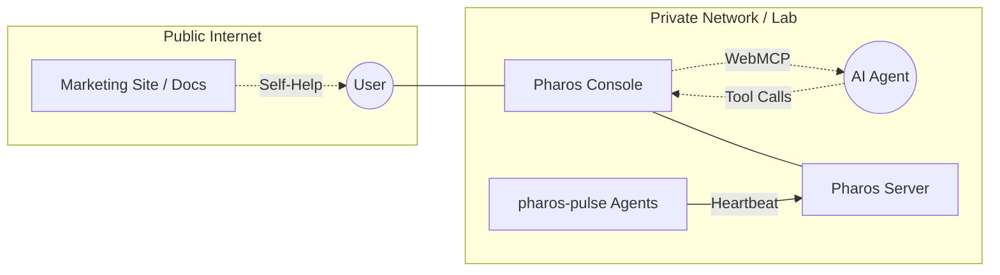

import TieredTabs from '../../components/TieredTabs.astro';

/* ========================================================================
 * Project: pharos
 * Component: Marketing Site
 * File: architecture.mdx
 * Author: Richard D. (https://github.com/iamrichardd)
 * License: AGPL-3.0 (See LICENSE file for details)
 * * Purpose (The "Why"):
 * Detailed architectural overview of the Pharos ecosystem.
 * * Traceability:
 * Related to GitHub Issue #28, implements the documentation port to MDX.
 * Related to GitHub Issue #55, implements tiered tab UX.
 * ======================================================================== */

Project Pharos is a highly performant, read-optimized client-server ecosystem based on RFC 2378 (Phonebook Protocol).

## System Overview

The following diagram illustrates the high-level architecture of Pharos, showing the interaction between CLI clients and the server components.


```mermaid
graph TD
    subgraph Clients
        PH[ph CLI - People]
        MDB[mdb CLI - Machines]
        SCAN[pharos-scan - Discovery]
    end

    subgraph "Pharos Server"
        TCP[TCP Listener :2378]
        Parser[RFC 2378 Parser]
        Auth[Auth Manager - SSH Keys]
        Metrics[Metrics Engine - Prometheus]
        StorageTrait[Storage Trait]
        
        subgraph "Storage Backends"
            Mem[MemoryStorage - Dev]
            File[FileStorage - Home Lab]
            LDAP[LdapStorage - Enterprise]
        end
    end

    PH -->|RFC 2378| TCP
    MDB -->|RFC 2378| TCP
    SCAN -->|mDNS / Port Probes| LAN((Local Network))
    LAN --> SCAN
    SCAN -->|RFC 2378| TCP
    TCP --> Parser
    Parser --> Auth
    Auth --> StorageTrait
    StorageTrait --> Mem
    StorageTrait --> File
    StorageTrait --> LDAP
    
    Metrics -.->|Observe| StorageTrait
    Metrics -.->|Observe| TCP
```

## Storage Tiering Logic

<TieredTabs>
  <div slot="homelab">
    ### 🏠 Home Lab: Persistent File Storage
    Pharos uses a file-level, restart-survivable JSON storage engine optimized for LXC containers. This ensures high performance with minimal configuration.

    ```mermaid
    graph LR
        File[FileStorage]
        File -.->|Persistent| JSON[(Local JSON File)]
    ```
  </div>

  <div slot="enterprise">
    ### 🏢 Enterprise: Centralized LDAP Storage
    For Enterprise environments, Pharos acts as a high-speed cache and query layer for your central LDAP directory, supporting standard schemas and high-concurrency reads.

    ```mermaid
    graph LR
        LDAP[LdapStorage]
        LDAP -.->|Centralized| Directory[(LDAP Server)]
    ```
  </div>
</TieredTabs>

## Core Protocol: RFC 2378 (Modified)

Pharos implements the Phonebook Protocol with extensions for modern infrastructure management and secure authentication.

### Message Flow
1. **QUERY:** Client sends a search string.
2. **DISCRIMINATE:** Server identifies if the target is a `person` or `machine`.
3. **AUTH (if Write):** Server issues an SSH challenge. Client signs and returns.
4. **RESPONSE:** Server returns records in Ph format.

`ADD`, `CHANGE`, and `DELETE` all follow the same AUTH-then-commit flow shown below for `ADD` —
`CHANGE` additionally requires a `make` (or `force`) clause to separate its selection criteria from
the fields it modifies, per RFC 2378 §3.10.


```mermaid
sequenceDiagram
    participant Client
    participant Server
    participant Auth
    participant Storage

    Client->>Server: QUERY "name=John"
    Server->>Storage: Search(people, "John")
    Storage-->>Server: [Records]
    Server-->>Client: 200: [Ph Records]

    Note over Client,Server: Write Operation
    Client->>Server: ADD "name=Jane"
    Server->>Auth: Challenge(SSH-Key)
    Auth-->>Client: Challenge
    Client-->>Auth: Signed-Response
    Auth-->>Server: Verified
    Server->>Storage: Commit(Jane)
    Server-->>Client: 200: Success
```

## Known RFC 2378 Deviations

:::note[RFC 2378 Protocol Deviations]
Pharos deliberately deviates from RFC 2378 in several places — here's what's intentional and what's still an open gap.
:::

### 1. No Field-Level Attribute or ACL System
RFC 2378 defines per-field keywords (e.g., `Public`, `Private`, `LocalPub`, `Sacred`, `Unique`, `Encrypt`, `Indexed`, `NoMeta`, `NoPeople`, `Turn`, `Any`, `Always`, `Default`, `ForcePub`, `Change`) governing visibility and mutability on a per-field basis. 
In contrast, Pharos's `Record` structure is implemented as a flat, metadata-free `HashMap<String, String>` inside `storage.rs`. Authorization is handled strictly at the record level (enforcing fingerprint/team ownership in `change_record` and `delete_record`). This is a deliberate, load-bearing design choice (Pharos's target use cases of home labs and small teams do not require field-level access controls).
* **Downstream Consequence:** Because there is no concept of field-level access control, schema discovery via the `fields` command is global. It reports field names (never values) harvested across all stored records regardless of which team owns them.

### 2. SSH-Key Challenge-Response Authentication
The native password-based and Kerberos login mechanisms described in RFC 2378 are replaced entirely by a modern, high-rigor SSH key-based challenge-response flow.
While the `login` command is supported, it is only dispatched to generate a challenge for the Pharos-specific `auth` command (which verifies cryptographic signatures using local SSH keys). Other RFC-defined authentication commands, such as `answer` (encrypted password response), `clear` (cleartext password), `email` (port/domain-based authentication), and `xlogin` (Kerberos v4/v5, GSSAPI, ANSI X9.9), parse successfully into `Command` variants but have zero dispatch logic behind them.

### 3. Parseable Commands Without Dispatch Logic
The parser recognizes all standard RFC 2378 commands. However, the server does not implement dispatch logic for the following seven commands:
* `SiteInfo`
* `Logout`
* `Answer`
* `Clear`
* `Email`
* `XLogin`
* `Help`
Any attempt to call these commands falls through to the generic Pharos extension response code `597:Command recognized, but not yet implemented` (deliberately distinct from a `598` syntax error).

### 4. Inert `set` Command Options
The `set` command is implemented in `lib.rs` with real enforcement for two safety-critical options: `limit` (capping the number of entries a `change` or `delete` may affect) and `addonly` (preventing fields from being overwritten).
The other five RFC-defined options—`echo`, `charset`, `verbose`, `nolog`, and `external`—are settable and reportable (via `set` with no arguments) but have no behavioral effect on the server:
* `echo` does not echo commands back.
* `charset` is accepted but no character set conversions are performed.
* `verbose` does not emit interim progress lines.
* `nolog` does not affect logging.
* `external` does not hide any fields because there is no field-keyword concept.

### 5. Response Code Alignments
Pharos aligns its response codes with Appendix B of RFC 2378. Two permanent design characteristics of this alignment include:
* **Extension Code `597`:** Pharos introduces the `597` response code specifically to denote a command that is recognized by the parser but not implemented by the dispatcher, distinguishing it from `598` (which indicates an unknown/unparseable command).
* **Authorization Gaps:** Where RFC 2378 does not provide specific codes for authorization failures, Pharos uses `511` ("not authorized to add entries") for `add`, `510` ("not authorized to change this entry") for `change`, and `516` ("no authorization for request") as a fallback for all other permission checks (such as unauthorized deletion or failed signature verification).

### 6. Wildcard Matching Escape Limitation
Pharos supports RFC 2378 wildcard matching for the `*`, `+`, `?`, and `[abc]` forms in any position or combination using a hand-rolled dynamic programming matcher (avoiding regular expression backtracking vulnerabilities and escaping complexity).
However, a deliberate limitation exists: there is no escape mechanism. Literal wildcard characters (such as `*`, `+`, `?`, `[`, or `]`) cannot be matched in search values, as they are always interpreted as pattern syntax.

## Core Components

### 1. Pharos Server (`pharos-server`)
The backend engine handling connection lifecycle, protocol parsing, and storage abstraction.
- **Protocol:** RFC 2378 (Ph) with `auth` extension.
- **Authentication:** SSH-key based challenge-response for Write operations.
- **Metrics:** Integrated Prometheus scrape point (`:9090/metrics`) and health monitoring.

### 2. CLI Clients
- **`ph`:** Optimized for human contact management.
- **`mdb`:** Optimized for machine/infrastructure asset management.
- **`pharos-scan`:** Automated discovery engine using mDNS and port probes to identify and provision assets into Pharos.
- All clients support automatic authentication via local SSH private keys and share a common async core.

### 3. Storage Tiering
- **Development:** Zero-configuration in-memory storage.
- **Home Lab:** File-level, restart-survivable JSON storage (optimized for LXC).
- **Enterprise:** LDAP-backed storage utilizing standard schemas (`inetOrgPerson`, `ipHost`).

### 4. Multi-Server Synchronization
Set `PHAROS_SYNC_ADDR` to have a node advertise itself as a replication peer and relay its own
`add`/`change`/`delete` writes to every other peer it's aware of. Set `PHAROS_BOOTSTRAP_PEER`
alongside it to pull an existing peer's full record set on startup. Peer awareness today is
gained through bootstrapping, not announced automatically in both directions — see the
[Server Setup guide](./server-setup) before relying on this for a production multi-node cluster.

## Multi-Tenant & Triple-Tier Security

Pharos implements a flexible security model designed to scale from a single user's "YOLO Lab" to a multi-tenant Enterprise environment.

<TieredTabs>
  <div slot="homelab">
    ### 🏠 Home Lab: The "YOLO" Security Model
    In Home Lab environments, Pharos prioritizes speed and accessibility.

    - **Open Access**: Read operations are anonymous and unauthenticated.
    - **SSH Challenge**: Write operations still require a valid signature from an authorized SSH key for basic safety.
    - **Use Case**: Single-user labs or trusted home networks.
  </div>

  <div slot="enterprise">
    ### 🏢 Enterprise: Protected & Scoped Models
    For larger environments, Pharos adds layers of isolation and authentication.

    - **Protected Tier**: Read access is restricted via tokens or IP whitelists.
    - **Scoped Tier**: Fully multi-tenant. Every record belongs to a `team_scope`.
    - **Filtering**: Queries are automatically filtered to only show records the user's authenticated identity is allowed to see.
    - **Provenance**: Records contain metadata tracking `created_by` identity and the `provisioned_at` timestamp.
  </div>
</TieredTabs>

## The Dual-Site Ecosystem

Pharos distinguishes between documentation (static) and management (dynamic) to ensure high availability and security.


```mermaid
graph LR
    User((User))
    Agent((AI Agent))
    
    subgraph "Public Internet"
        Marketing[Marketing Site / Docs]
        Marketing -.->|Self-Help| User
    end
    
    subgraph "Private Network / Lab"
        Server[Pharos Server]
        Console[Pharos Console]
        Pulse[pharos-pulse Agents]
        
        Console --- Server
        Pulse -->|Heartbeat| Server
        Console -.->|WebMCP| Agent
        Agent -.->|Tool Calls| Console
        User --- Console
    end
```

### 1. Marketing & Documentation (`iamrichardd.com/pharos/`)
- **Type**: Static Site (Astro/MDX).
- **Purpose**: Architecture guides, "How-To" tutorials, and open-source advocacy.
- **Why**: Ensures that even if your Pharos server is down, you still have access to the documentation on how to fix it.

### 2. Pharos Console (`pharos-console`)
- **Type**: Dynamic Web Application & MCP Server.
- **Purpose**: Real-time TUI/Web dashboard, SSH key management, and AI Agent orchestration.
- **Features**:
    - **WebMCP Bridge**: Allows your browser to act as a secure proxy for AI Agents.
    - **MDB Search**: High-performance inventory querying with visual search results.
    - **Enrollment**: One-click provisioning for new nodes.
